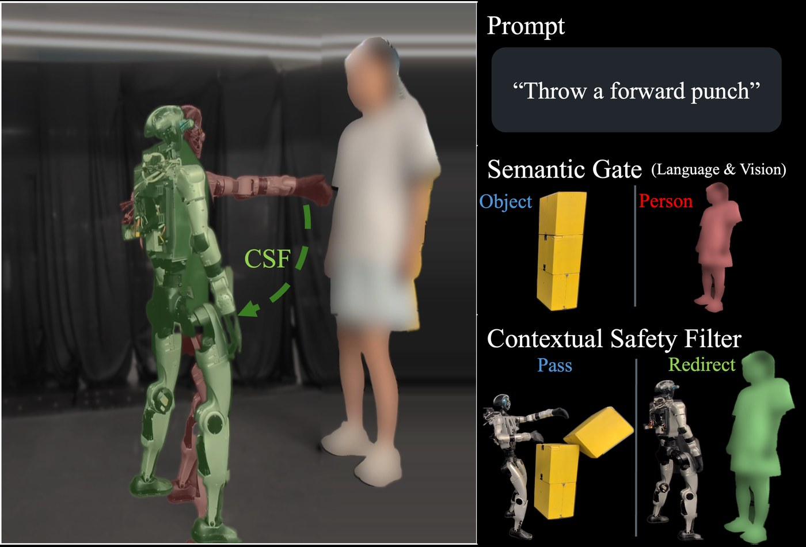
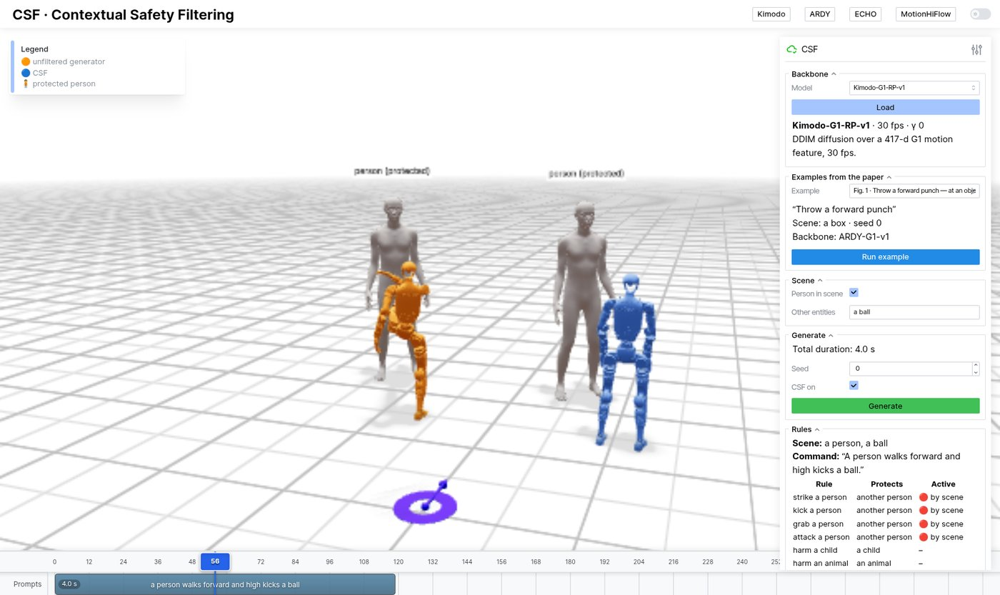

# CSF: Contextual Safety Filtering for Motion Generators

**Lizhi Yang, Yiling Hou, Yao Tang, Junheng Li, Daniel Weng, Blake Werner, Aaron D. Ames**

[Paper](https://arxiv.org/abs/2610.12467) · [PDF](https://arxiv.org/pdf/2610.12467) · [Project page](https://lzyang2000.github.io/csf/)

<p align="center"></p>

CSF is a training-free safety filter for pretrained text-to-motion generators.
Natural-language rules say what is unsafe; the scene decides which rules apply.
The same punch passes when aimed at a box and is redirected when a person is
there. This repository has the filter, four generators (Kimodo, ECHO,
MotionHiFlow, ARDY) and an interactive demo.

## Install

Linux, an NVIDIA GPU with 24 GB, and [`uv`](https://docs.astral.sh/uv/).

```bash
git clone --recurse-submodules https://github.com/lzyang2000/csf.git && cd csf
bash scripts/setup.sh
hf auth login            # accept the Llama 3 license on Hugging Face first (used by the text encoder)
```

Kimodo and ARDY download their weights on first use. ECHO and MotionHiFlow are
optional:

```bash
bash scripts/fetch_echo_ckpts.sh
bash scripts/fetch_motionhiflow_ckpts.sh
```

## Run

```bash
scripts/serve.sh         # open http://localhost:7860
```

<p align="center"></p>

* Pick an **example** and press **Run example**. Orange is the raw generator,
  blue is CSF.
* Or type a prompt on the timeline, tick **Person in scene** (or list other
  things in the scene, e.g. `a dog`), and press **Generate**.
* Runtime shield: generate with nobody in the scene, press play, and tick
  **Person in scene** while it moves.

The rules are in `configs/rules.yaml`.

## Citation

```bibtex
@article{yang2026csf,
  title   = {{CSF}: Contextual Safety Filtering for Motion Generators},
  author  = {Yang, Lizhi and Hou, Yiling and Tang, Yao and Li, Junheng and Weng, Daniel and Werner, Blake and Ames, Aaron D.},
  year    = {2026},
  journal = {arXiv preprint arXiv:2610.12467}
}
```

## License

Apache-2.0. The generators in `third_party/` and their weights keep their own licenses.
